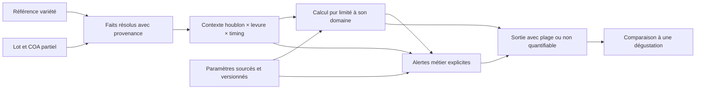

# Index Houblon — socle variétés/lots et audit du dépôt

Proposition du **8 septembre 2026**, issue de l’étude des 7–8 septembre, à lire avec
[les réponses scientifiques sourcées](index-houblon-recherche.md).

**Conception initiale, suivie d’une implémentation locale le 8 septembre.**
L’audit ci-dessous décrit le dépôt avant intervention. Les collections, tâches IA,
écrans et contrats effectivement ajoutés sont décrits dans
[l’état d’implémentation](index-houblon-implementation.md). Les esquisses de cette
note ne remplacent pas les validateurs du code. La validation scientifique des
modèles prédictifs reste distincte de la validation logicielle.

## Premier résultat à construire

L’utilisateur recherche une variété, ouvre une fiche documentée, enregistre un
lot avec un COA partiel et voit, champ par champ, ce qui provient du lot, ce qui
provient du référentiel, et ce qui reste inconnu. Il peut retrouver cette fiche
après synchronisation et restauration d’une sauvegarde.

La fiche présente le **potentiel documenté** de l’ingrédient. Elle n’affiche aucun
score de bière ni prédiction aromatique sans levure et timing. Recherche par nom,
alias ou descripteur publié signifie recherche documentaire, pas classement
prédictif. Une liste vide, une source absente ou un échec de recherche IA laisse la
saisie manuelle et les données déjà connues utilisables.

## Audit confirmé par lecture

État examiné : branche `codex/adaptive-brew-day`, commit
`cc26602878555c5fc5723c5a0cf5b2fd9101b583`. Arbre de travail propre avant cette
étude. Aucun fichier `AGENTS.md` trouvé dans le dépôt ni aux emplacements parents
examinés.

| Besoin | Constat et conséquence |
| --- | --- |
| CRUD et cache | [firestoreRepo.ts](../src/services/firestoreRepo.ts) fournit bien `all<T>`, `put`, `remove`, `onSnapshot`, notifications, file d’écriture et états de synchronisation. Réutiliser cette couche. `put()` retourne `void` : une saisie locale ne vaut pas confirmation du serveur ; réutiliser les états et `waitForWrites()` quand cette confirmation est nécessaire. |
| Déclaration de collection | [dataSchema.ts](../functions/src/dataSchema.ts) alimente bien synchronisation, sauvegarde et historique. **Complément :** `CollectionName` est encore une union manuelle dans `firestoreRepo.ts`. L’ajout doit la mettre en cohérence, de préférence par alias du type `BusinessCollection` existant. |
| Façade de stockage | [storage.ts](../src/services/storage.ts) contient `clean<T>()` et `syncCollection<T>()`. Ces fonctions sont privées au module : ajouter des méthodes métier dans cette façade. `clean` retire `__docId`, sans validation métier. |
| Diff des écritures | `syncCollection` compare les documents et supprime ceux absents de la liste reçue. C’est un remplacement de collection, **pas un import partiel**. Ne jamais lui passer une recherche filtrée ou uniquement les lignes d’un import à fusionner. |
| Règles | [firestore.rules.template](../firestore.rules.template) contient `collectionsMetier()`. **Correction :** [check-rules.mjs](../scripts/check-rules.mjs) lit le fichier généré `firestore.rules`, pas directement le template. Générer puis contrôler. Ce contrôle textuel de couverture ne remplace pas un test d’autorisation. |
| Sauvegarde et import | [backupCore.ts](../functions/src/backupCore.ts) valide tout le fichier et ses IDs. **Complément :** le diff/no-op effectif et la reprise par reçu d’opération sont dans [dataBackup.ts](../functions/src/dataBackup.ts), avec `stableJson`. Des IDs stables seuls ne garantiraient pas zéro réécriture. |
| Validation des nouveaux documents | Le parseur de backup possède quelques validations par collection, dont une liste explicite de collections avec `data.id === row.id`. Déclarer un nouveau nom ne lui donne pas automatiquement un validateur métier : ajouter les invariants variétés/lots aux points d’import et de lecture concernés. |
| Historique | [dataHistory.ts](../functions/src/dataHistory.ts) observe les collections métier et ignore les changements identiques. Il n’est pas nécessaire de recréer un journal de modifications de fiches. Il ne dispense pas de figer les entrées des futures prédictions. |
| Repli à la lecture | [hopStage.ts](../src/domain/hopStage.ts) confirme le pattern de fonction pure `normalizeHop`. Réutiliser cette séparation, **pas ses inférences historiques** : un rang d’ajout ou un jour reconstitué ne prouve pas un timing physiologique observé. |
| Enrichissement existant | [ingredientFacts.ts](../src/domain/ingredientFacts.ts) sert à apprendre ponctuellement des caractéristiques de stock. Ce n’est pas un résolveur lot/variété. Ses valeurs ponctuelles et sa provenance globale ne couvrent pas la traçabilité par mesure souhaitée ici. |
| IA | [prompts.ts](../functions/src/prompts.ts) contient `TASKS`, `TaskId` et `lookupIngredient` avec ancrage et source. [ai.ts](../functions/src/ai.ts) fournit la passerelle générique en `europe-west6`, déjà capable de recevoir un fichier selon la tâche. Ajouter une tâche n’exige pas une nouvelle Cloud Function. |
| Typage IA client | [aiClient.ts](../src/services/aiClient.ts) possède sa propre union `AiTaskId`. La compléter avec la tâche serveur. Un champ `source` textuel demandé à Gemini ne prouve pas que la source contient la valeur : prévoir une validation métier et une proposition relisible. |
| Consignes IA | Le helper générique `NE_RIEN_INVENTER` de `prompts.ts` utilise zéro pour un nombre illisible dans ses domaines historiques. **Ne pas le reprendre pour les analyses de houblon** : absent, non détecté et zéro mesuré doivent rester différents. |
| Tests IA | [check-test-boundary.mjs](../scripts/check-test-boundary.mjs) contrôle les commandes et les sélections Vitest. [paid-ai-test-guard.mjs](../scripts/paid-ai-test-guard.mjs) exige l’opt-in des tests réels. Cette frontière ne fait pas une analyse de tous les appels réseau : les nouveaux tests normaux doivent explicitement simuler Gemini et Firebase. |
| Navigation | [BottomNav.tsx](../src/components/BottomNav.tsx) et [App.tsx](../src/App.tsx) confirment `TabType`, `TABS` et le state `subTab`. Ajouter un onglet implique aussi [fabActions.ts](../src/domain/fabActions.ts), ses sous-onglets/actions, et [brewerAppScreens.ts](../functions/src/brewerAppScreens.ts) pour le contexte du compagnon. |
| Types existants | [types/index.ts](../src/types/index.ts) définit `StockItem`, `HopIngredient`, `HopStage`, `YeastSpec`. Aucun objet de lot de houblon avec COA n’y est défini. `HopStage` ne distingue pas à lui seul cru en fermentation et cru après fermentation. |
| Analogue du calcul | [water/substances.ts](../src/domain/water/substances.ts) et [waterStyles.ts](../src/domain/waterStyles.ts) sont bien des données TypeScript embarquées. Les profils d’eau portent maintenant des sources documentées, mais ne sont pas des paramètres Firestore éditables. Reprendre la séparation des modules purs, pas le stockage des coefficients. |

L’inscription de nouvelles collections demandera une livraison coordonnée du
client, des règles et des fonctions consommant `dataSchema.ts`. « Coefficients
modifiables sans redéploiement » concernera ensuite leur **contenu**, pas
l’installation initiale de cette infrastructure.

## Esquisse du référentiel, sans moteur

### Deux petits ensembles avec une responsabilité chacun

La première collection proposée est `hopVarieties` : une fiche par variété.
Un lot analysé a une identité et une durée de vie propres ; pour vérifier le
parcours complet du premier incrément, proposer ensuite `hopLots`, collection
voisine et simple. Cela évite de mélanger les moyennes de variété, les achats et
les analyses de plusieurs lots dans un même document.

| Ensemble proposé | Contenu minimal | Ce qu’il représente |
| --- | --- | --- |
| Variété | Identifiant stable, nom, alias, origine documentée si connue, descriptions sourcées, valeurs typiques documentées, révision | Une référence documentaire, sans score aromatique autonome |
| Lot | Identifiant stable, référence de variété, numéro fournisseur s’il existe, récolte/origine/forme connues, lien facultatif vers `stockItems.ref`, analyses partielles et références des COA | Un produit physique identifié ; les champs absents restent absents dans l’enregistrement |
| Source embarquée | Identifiant local, organisme/auteur, titre/référence, URL ou pièce source, année connue ou statut inconnu, date de consultation/saisie, emplacement | La provenance des faits de la fiche, sans créer tout de suite une collection de bibliographie |

Le lien de stock est facultatif. Les quantités, prix et mouvements restent gérés
par les mécanismes de stock existants ; le COA ne devient pas un second inventaire.
Un lot peut être saisi avant l’achat ou pour documenter une dégustation. Un
numéro de lot fournisseur seul n’est pas nécessairement un identifiant global.

Les descriptions conservent leur texte original, leur source et le contexte
d’observation connu. Les mots de recherche peuvent être normalisés sans convertir
les descriptions en intensités. Un alias facilite la recherche, mais ne fusionne
pas automatiquement deux variétés homonymes.

### Une mesure porte sa signification

Pour commencer : acides alpha/bêta, huiles totales et composés individuellement
documentés. Les thiols et précurseurs restent facultatifs. Ne pas demander une
analyse complète pour enregistrer une fiche. La liste initiale de champs
analytiques pourra rester courte ; ce n’est pas une ontologie chimique générique.

| Information de mesure | Exigence proposée |
| --- | --- |
| Identité | Analyte, forme libre/conjuguée et isomère si la source le précise ; sinon conserver l’ambiguïté |
| Valeur rapportée | Distinguer valeur ponctuelle, plage publiée, borne de détection/quantification et non déterminé |
| Unité et base | Par exemple % massique du houblon, mL/100 g, % de la fraction d’huile, µg/kg de houblon ou ng/L de bière ; préciser matière sèche/telle quelle si publié |
| Domaine | Variété ou lot, forme du produit, récolte et méthode lorsqu’elles sont connues |
| Provenance | Référence vers la source et son emplacement pour cette mesure, année ou absence explicitement enregistrée |
| Incertitude | Reprendre celle publiée avec sa nature ; ne pas la déduire du nombre de décimales |
| Qualité d’entrée | Information exploitable, à vérifier ou inexploitable, avec raison ; conserver la transcription brute en cas d’ambiguïté |

Les unités sont des contraintes de sens, pas des décorations. Ne pas convertir
des pourcentages relatifs d’huiles en concentrations de bière sans les autres
données nécessaires. Ne pas additionner des concentrations massiques de conjugués
différents comme si leurs masses molaires étaient identiques. Les paramètres
chimiques nécessaires à de telles conversions devront eux aussi être sourcés.

Un document sans année peut rester une pièce documentaire à qualifier. Une valeur
sans provenance n’entre pas dans les faits utilisables ; sa saisie brute peut
rester en brouillon, sans devenir une mesure validée. Aucun coefficient actif ne
pourra avoir une provenance ou une année manquante. La date de consultation ne
remplace jamais l’année de publication, et la récolte n’est pas l’année du COA.

### Repli pur, par champ et par contexte

Contrat conceptuel : `resolveHopFacts(lot, variety)` retourne pour chaque champ
la donnée retenue, son origine (`lot`, `variety`, `unknown`), sa source, sa nature
d’incertitude et les raisons de limitation. Il ne modifie aucun de ses arguments
et ne déclenche aucune écriture.

Ordre de résolution proposé :

1. Utiliser une observation du lot exploitable et compatible avec le champ demandé.
2. Si la mesure est absente, chercher une donnée typique de la variété applicable
   au produit et à la base de mesure. L’étiqueter « référence variété », jamais
   « mesure du lot », et conserver ses limites.
3. Si rien ne convient, afficher « non renseigné » avec la raison. Le reste de la
   fiche demeure disponible.

Les cas suivants font partie du contrat, et pas d’un futur raffinement :

| Cas | Résultat attendu |
| --- | --- |
| Valeur mesurée égale à zéro avec source explicite | Zéro conservé. Pas de repli fondé sur `value || default`. |
| « Non détecté », avec limite publiée | Conserver le statut et la borne. Ce n’est pas un champ absent ; ne pas l’écraser par une moyenne de variété. |
| « Non détecté », sans limite connue | Conserver l’observation censurée ; pas de concentration zéro ou de limite imaginée. |
| COA ponctuel sans incertitude publiée | Afficher la valeur rapportée et « incertitude non fournie » ; aucun faux intervalle exact. |
| Lot hors de la plage typique | Montrer le COA et l’écart au référentiel. Ne pas ramener le lot dans la plage ni moyenner les deux. |
| Donnée illisible, unité ambiguë ou plage inversée | Conserver un signal de qualité ; ne pas exposer un nombre exploitable. Un éventuel repli variété doit annoncer que la mesure du lot est inutilisable. |
| Produit concentré, fiche décrivant des pellets ordinaires | Pas de repli chimique incompatible. L’identification de variété peut rester utile. |
| Variété non chargée ou inaccessible | « Référence temporairement indisponible », distinct de « variété sans données » ; conserver ce que le lot documente. |
| Référence variété introuvable ou archivée | Lot toujours consultable. Pas de suppression en cascade ni de variété inventée. |
| Mise à jour de la variété | Les champs hérités changent à la lecture ; les mesures enregistrées dans le lot ne sont pas réécrites. |

Ne pas copier les valeurs héritées dans le lot lors de l’enregistrement du
formulaire. Sinon une valeur typique se transformerait discrètement en analyse
mesurée et empêcherait les replis futurs de fonctionner.

Pour la cohérence des liens, proposer l’archivage d’une variété utilisée. Une
suppression de fiche documentaire ne doit jamais supprimer un lot, un achat ou un
mouvement de stock. Les futures prédictions conserveront leurs propres snapshots.

## Parcours utilisateur du premier incrément

Proposition : une entrée « Index houblon » dans l’espace Stocks, avec une vue
référentiel et un accès aux lots, en réutilisant les sous-onglets. Un onglet majeur
pourra devenir utile lorsque la recherche par profil et les dégustations seront
présentes. Ce placement est un choix d’interface réversible.

1. **Rechercher.** Recherche locale par nom/alias, filtres documentaires. Une
   action séparée cherche une fiche officielle via l’IA à la demande.
2. **Relire la fiche.** Nom proposé, valeurs publiées, plages, sources et champs
   absents sont visibles avant enregistrement. Une recherche infructueuse ouvre
   une fiche manuelle utilisable.
3. **Ajouter un lot.** Choisir la variété, saisir les informations connues et les
   seules mesures disponibles. La lecture IA d’un COA peut préremplir une
   proposition, sans inventer ce qui est illisible.
4. **Comparer les origines.** Chaque ligne affiche « COA du lot », « référence
   variété » ou « inconnu ». La précision du lot ne se propage pas aux champs qui
   n’ont pas été analysés.
5. **Enregistrer et retrouver.** Afficher l’état de synchronisation réel. Le
   rechargement, l’export et la restauration gardent mesures et sources.

Préférer des lignes de mesures lisibles à un score global de complétude. Une fiche
riche en informations d’identité mais sans analyse de thiols ne doit pas paraître
précise sur les thiols. Les classes de confiance concernent une affirmation
déterminée, pas le nombre de champs remplis.

## Recherche IA et import : réutiliser la passerelle, renforcer les preuves

Proposer deux tâches dans `TASKS`, avec ajout à `TaskId` et `AiTaskId` : recherche
documentaire de variété (`grounded: true`, sans fichier) et transcription d’un
COA (`acceptsFile: true`). La seconde utilise la pièce jointe comme preuve ; une
recherche web ne doit jamais combler silencieusement une analyse de lot.

Leurs sorties doivent distinguer trouvé/non trouvé, contenu rapporté, provenance
par mesure, unités, plage ou censure et ambiguïtés. Aucun helper convertissant
l’absence en zéro. La recherche, même ancrée, fournit une **proposition** : vérifier
le sens et la présence effective des références, puis laisser la fiche relisible
avant de l’enregistrer. L’IA ne décide pas d’un rendement chimique, ne transforme
pas une appréciation « tropical » en nombre et ne valide pas seule sa propre
confiance.

Pour un import de référentiel, reprendre le pattern de validation intégrale et de
diff existant. Valider les IDs, les liens, les nombres finis, les unités et les
provenances avant toute écriture. Un import partiel fusionne les lignes explicitement
présentes ; les lignes absentes sont conservées. Un fichier structurellement
invalide laisse la collection intacte et retourne une explication lisible.

Les IDs sont créés une fois et conservés à l’export/réimport ; un renommage ne
change pas l’ID. Un second import identique ne réécrit pas les documents métier.
Ne pas rafraîchir `updatedAt` ni générer de nouveaux IDs à chaque comparaison.
Un reçu technique d’opération n’est pas une deuxième copie de la fiche.

## Plan de réalisation et de réception

Les étapes ci-dessous sont un ordre proposé selon les dépendances, sans dates ni
estimation de charge artificielle.

| Étape | Résultat vérifiable | Condition de passage |
| --- | --- | --- |
| Fondations documentaires | Identités, faits partiels, provenance et résolveur pur | Cas de repli et d’unités testés sans React, Firebase ou Gemini réels |
| Premier incrément complet | Recherche/saisie variété, lot partiel, affichage des origines, sauvegarde/restauration | Parcours UI et persistance vérifiés, import rejoué sans écritures métier inutiles |
| Observations et contexte | Dégustations maison/commerciales, lexique versionné, contexte levure/timing explicite | Inconnues conservées, observations séparées des prédictions |
| Alertes documentées | Premières alertes qualitatives sur le contexte disponible | Chaque alerte explique ses preuves et son statut d’évaluation |
| Premier modèle limité | Un périmètre chimique/sensoriel avec paramètres éditables et sourcés | Tables et incertitudes examinées, domaine connu, tests de bilan et de dégradation ; aucune généralisation implicite |
| Recherche par profil | Pistes de triplets classées quand la comparaison est défendable | Plages et confiance par sortie, gestion des ex æquo/incomparables, écarts de dégustation conservés |

### Scénarios d’acceptation du socle

Les données de test numériques seront clairement **synthétiques**, réservées aux
tests, jamais présentées comme des valeurs réelles d’une variété commerciale.

| Scénario | Vérification |
| --- | --- |
| Variété sans analyse | Enregistrement et recherche possibles ; champs inconnus visibles, aucun score aromatique |
| COA seulement alpha | Alpha lu depuis le lot ; autres mesures héritées uniquement si compatibles ; aucune copie des replis dans le document lot |
| Zéro / absent / non détecté | Trois états distincts après saisie, rechargement et export |
| Origine d’une valeur | La source de variété ne remplace jamais celle du lot ; année inconnue signalée |
| Révision de variété | Une nouvelle valeur typique modifie uniquement la vue résolue des champs absents du lot |
| COA contradictoire | La donnée mesurée reste visible avec un avertissement ; elle n’est ni tronquée ni moyennée |
| Forme ou unité incompatible | Champ non exploitable sans bloquer le reste de la fiche ; aucune conversion inventée |
| Import avec une erreur tardive | Aucune écriture avant validation de toutes les lignes |
| Réimport identique | Pas de nouveaux documents ni écritures métier supplémentaires, y compris les dates de mise à jour |
| Import d’un sous-ensemble | Les autres variétés/lots ne sont ni supprimés ni modifiés |
| IA indisponible ou réponse sans preuve | Saisie manuelle et brouillon conservés ; réponse non promue en fait validé |
| Réseau interrompu | Pas de succès serveur mensonger ni assimilation d’une collection non chargée à une collection vide |
| Sauvegarde/restauration | Sources, statuts analytiques et liens retrouvent le même sens ; documents préexistants absents du fichier conservés |
| Navigation et compagnon | Actions du bouton et contexte affiché correspondent au sous-onglet houblon |

Les tests normaux doivent utiliser des réponses IA préenregistrées et des dépôts
simulés. Tout futur test appelant réellement Gemini reste hors du pipeline normal
et passe obligatoirement par `requirePaidAiTestOptIn()`. Aucune modification de
la frontière existante pour rendre un test plus commode.

## Contrat réservé au futur moteur piloté par les données

Cette partie fixe des invariants de conception, sans décider aujourd’hui du
nombre de collections de coefficients ni de leur schéma définitif.

Le calcul reçoit un snapshot de paramètres chargé par la façade Firestore. Il ne
fait pas lui-même de lectures réseau et ne dépend pas de React. Un changement de
paramètres validés modifie les nouveaux calculs via la synchronisation existante.
Une indisponibilité du jeu de paramètres produit un résultat explicatif ; elle
ne fait pas basculer sur des coefficients chimiques cachés dans le code.

Pour chaque paramètre actif : valeur/plage et unité, signification, source avec
année, emplacement précis, méthode et domaine d’application, nature de
l’incertitude, révision et statut. Une pondération de préférence interne ou un
seuil de classe n’échappe pas à ce contrat. La politique de confiance proposée
doit elle aussi être modifiable et identifiée comme jugement interne.

Les structures de programme et contraintes mathématiques restent du code ; les
rendements, transferts, seuils sensoriels, masses molaires employées, coefficients
empiriques et pondérations restent de la donnée sourcée. La présence de nombres
dans une fixture de test ne doit jamais fournir un jeu de paramètres de secours
en production.

Une prédiction conserve le triplet, les entrées effectives, les champs hérités,
le contexte manquant et les révisions exactes des paramètres, du moteur et du
lexique. Les unités de sortie, la plage et son sens, la confiance, les preuves
et les raisons d’abstention restent inspectables. Modifier un coefficient ne
réécrit pas les prédictions historiques.

La recherche par profil ne classe pas une variété sans contexte. Une combinaison
sans modèle applicable reste une piste documentaire non quantifiée. Pour celles
qui sont quantifiables, une future fonction de rapprochement au profil devra
propager l’incertitude et documenter ses poids ; des plages qui se chevauchent
peuvent rendre deux pistes indépartageables. Aucun score ponctuel « meilleur
houblon » ne sera un raccourci acceptable.

## Vérifications de la conception initiale

- Lecture directe des fichiers du tableau, des types, de la configuration Vitest
  et des tests de sauvegarde existants.
- `node scripts/check-test-boundary.mjs` : réussi.
- `node scripts/check-rules.mjs` : réussi, 17 collections couvertes dans les règles
  générées présentes. Le générateur n’a pas été exécuté et rien n’a été déployé.
- Contrôle documentaire : les 24 liens locaux des deux dossiers se résolvent ;
  aucune clôture de bloc de code manquante ni anomalie d’encodage détectée.
- Les essais métier et UI de l’incrément ci-dessus sont des **critères à réaliser**,
  pas des tests déjà passés d’une fonctionnalité existante.

Les vérifications logicielles ultérieures sont consignées dans
[l’état d’implémentation](index-houblon-implementation.md).

Les incertitudes restantes concernent l’extraction quantitative des publications,
la validation de la représentation sensorielle et les données réelles disponibles.
Elles n’empêchent pas de réaliser le référentiel documentaire et le repli de COA.
